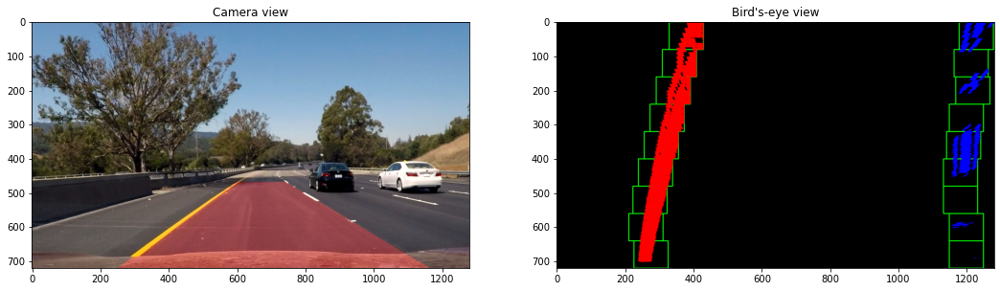

# Lane Lines Detection
This is a project for the Digital Image Processing course, based on the [Udacity Self-Driving Car Nanodegree](https://www.udacity.com/course/self-driving-car-engineer-nanodegree--nd013). It consists in building a pipeline to detect lane lines in a video shoot from a moving vehicle. In the first part, we focus on detecting straight lines in a simpler situation, while in the second part we focus on typical problems, such as correcting distorted images, perform perspective transformations and detecting also curved lines.

## The project
A detailed description of the project can be found in the IPython notebooks:
- **[Base lane lines detection](https://github.com/pietroventurini/lane-lines-detection/blob/master/Base_lane_lines_detection.ipynb)** (Edge detection, Hough transform)

- **[Advanced lane lines detection](https://github.com/pietroventurini/lane-lines-detection/blob/master/Advanced_lane_lines_detection.ipynb)** (Camera calibration, distortion correction, perspective transformations)

